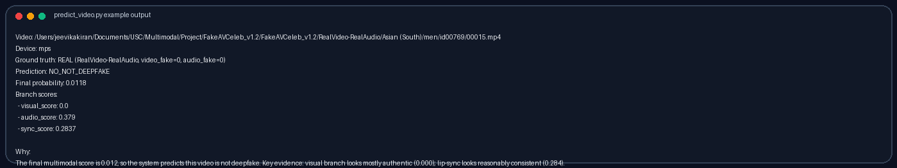

# Multimodal Deep-fake Detection using Audio-Visual Alignment

This project builds a multimodal deepfake detection system that combines **visual**, **audio**, and **audio-visual synchronization** signals to produce a single per-video deepfake probability. The core pipeline is implemented in `main.ipynb` and operates on the **FakeAVCeleb** dataset.

The repo now includes:
- a corrected **unique clip-ID manifest** for FakeAVCeleb
- a pretrained **SyncNet** branch for lip-sync / AV-mismatch scoring
- a final **late-fusion model** that combines `visual_score`, `audio_score`, and `sync_score`
- a single-video inference script: `predict_video.py`

## Project Goals

Deepfakes are increasingly realistic and harder to detect with visual-only methods. This project targets that gap by jointly analyzing:
- Visual facial artifacts
- Audio authenticity
- Lip-sync / audio-visual alignment

## Approach Summary

The system has three branches and a fusion stage:
- **Visual pipeline**: Extract frames, detect faces with MTCNN, fine-tune EfficientNet-B0 on face crops, and aggregate frame-level predictions into a per-video `visual_score`.
- **Audio pipeline**: Extract 16kHz mono audio, compute Wav2Vec2 embeddings, train a classifier, and output per-video `audio_score`.
- **Sync pipeline**: Use pretrained SyncNet on tracked face clips and aligned audio to compute a `sync_score = P(audio-video mismatch | video)`.
- **Fusion**: A late-fusion Logistic Regression model combines `visual_score`, `audio_score`, and `sync_score` into the final probability `P(deepfake | video)`.

## Example Output

The repository includes a single-video inference script:

```bash
python predict_video.py "/absolute/path/to/video.mp4"
```

Example output from `predict_video.py`:



The script returns:
- the final deepfake / not-deepfake decision
- branch scores from the visual, audio, and sync models
- the inferred ground-truth label when the input video comes from FakeAVCeleb
- a short explanation describing which branches drove the prediction

## Setup

Recommended Python packages (from the notebook):
- `torch`, `torchvision`, `timm`
- `transformers`
- `facenet-pytorch`
- `opencv-python`
- `pandas`, `numpy`, `scikit-learn`, `matplotlib`, `tqdm`
- `imagehash`, `Pillow`

Optional tools:
- `ffmpeg` (audio extraction)

## Usage (Notebook)

Open `main.ipynb` and follow the sections in order:
1. **Generate dataset metadata** (scans FakeAVCeleb directory)
2. **Dataset inspection and balancing**
3. **Frame extraction** (uniform sampling + near-duplicate removal)
4. **Face detection with MTCNN** (saves face crops, mouth ROIs, and detections)
5. **Per-frame dataset creation** (face + mouth crops)
6. **Visual model training** (EfficientNet-B0 fine-tuning, per-video aggregation)
7. **Audio embeddings and audio model** (Wav2Vec2 multiseg embeddings, per-video scores)
8. **Evaluation** (accuracy, ROC-AUC, confusion matrix)

## Usage (Single Video)

Run inference from the project folder:

```bash
python predict_video.py "/Users/jeevikakiran/Documents/USC/Multimodal/Project/FakeAVCeleb_v1.2/FakeAVCeleb_v1.2/RealVideo-RealAudio/Asian (South)/men/id00769/00015.mp4"
```

For JSON output:

```bash
python predict_video.py "/Users/jeevikakiran/Documents/USC/Multimodal/Project/FakeAVCeleb_v1.2/FakeAVCeleb_v1.2/RealVideo-RealAudio/Asian (South)/men/id00769/00015.mp4" --json
```

## Outputs

Typical outputs generated by the project:
- `processed/**/detections.csv` with per-frame face bounding boxes
- `processed/**/face_crop.jpg` and `processed/**/mouth_roi.jpg`
- `processed_perframe/**/faces/` and `processed_perframe/**/mouth/`
- `models/visual_effnet_b0_perframe.pth`
- `models/visual_scores_perframe.csv`
- `models/audio_mlp_best.pth`
- `audio_scores_pervideo.csv`
- `syncnet_scores_pretrained.csv`
- `models/fusion_best_model.joblib`
- `fusion_scores_pervideo.csv`

## Final Validation Results

Final sync-branch result:
- **Sync branch**: ROC-AUC `0.7588`, Accuracy `0.7067`

Final multimodal result:
- **Fusion model**: late-fusion Logistic Regression
- **Validation ROC-AUC**: `0.9993`
- **Validation Accuracy**: `0.9867`
- **Confusion Matrix**:

```text
[[75, 0],
 [ 2, 73]]
```

## Dataset

This project uses the **FakeAVCeleb** dataset, a multimodal deepfake dataset containing both authentic and manipulated celebrity videos with synchronized audio. It includes face-swapping, lip-sync alteration, and synthetic audio generation, with a balanced distribution of real and fake samples.

## Notes

- The dataset and intermediate outputs are large; keep them on local disk rather than committing to git.
- Frame sampling and duplicate removal are designed to reduce redundancy and keep training feasible.
- For fair evaluation, the notebook splits by **video** rather than frame to prevent leakage.
- The single-video inference script can infer ground truth only for videos that still live inside the FakeAVCeleb directory structure.
